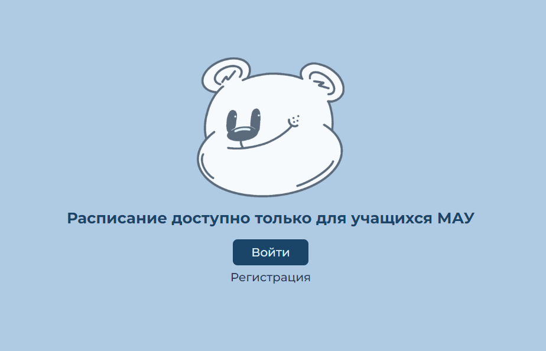
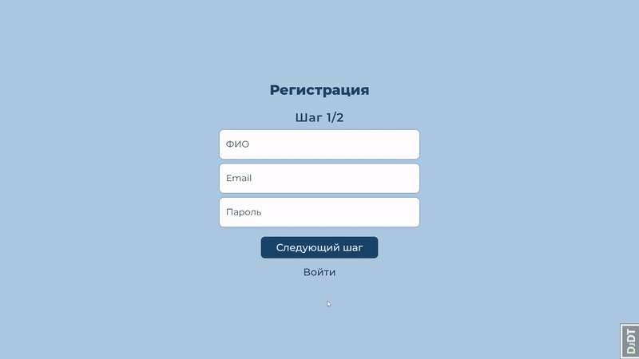
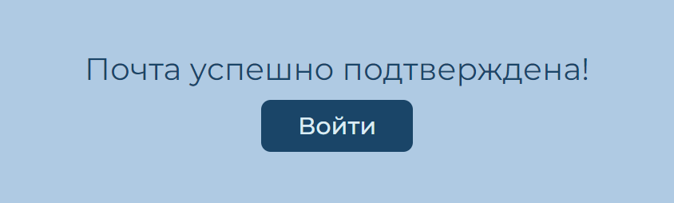
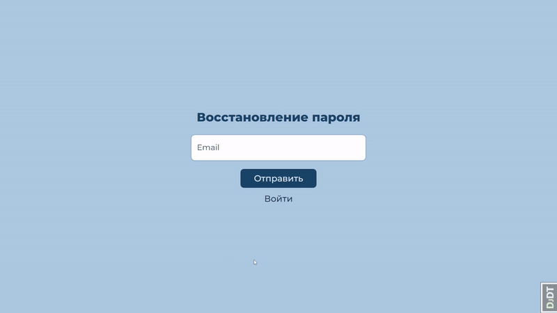
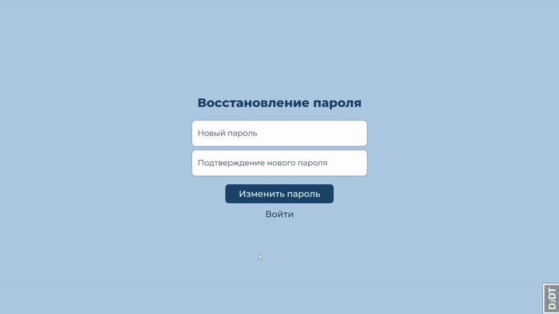
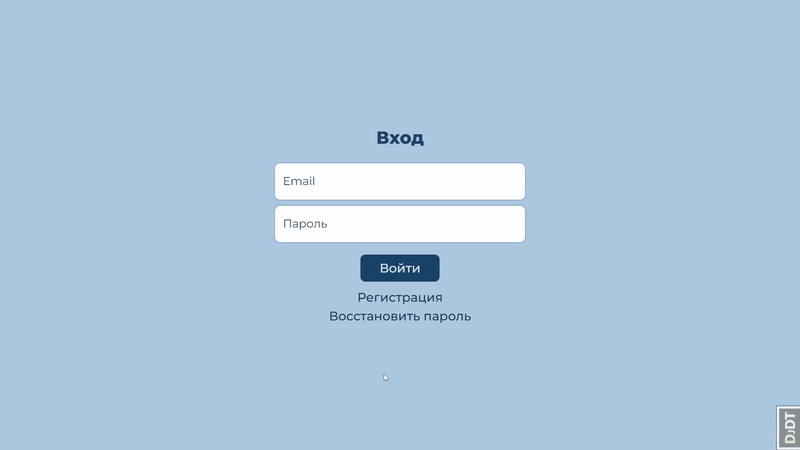
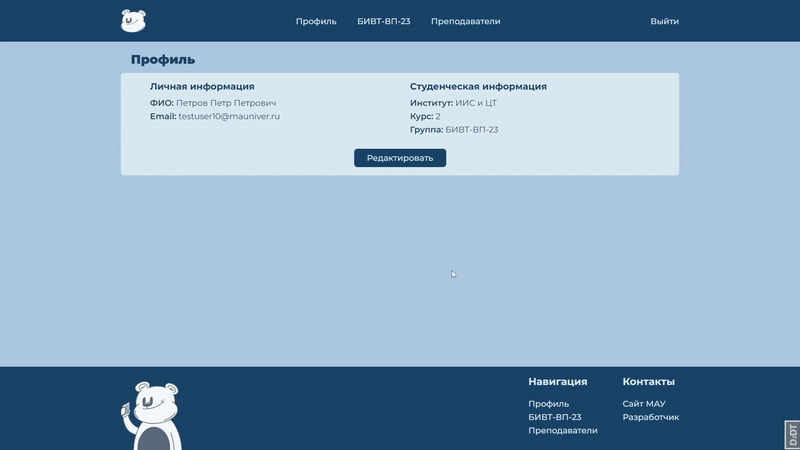
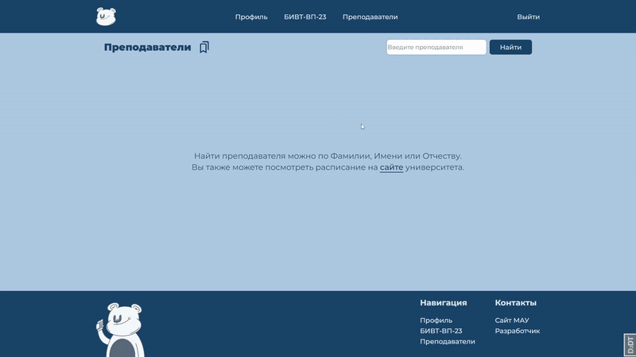
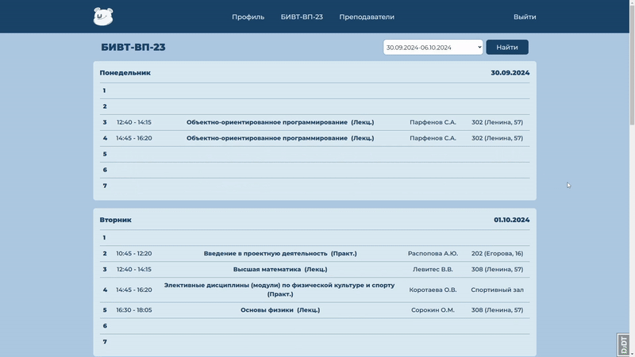
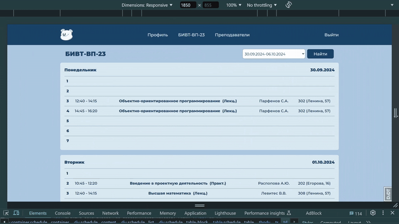

# MAU Schedule


--------------------


--------------------

Приложение представляет собой сайт-расписание для студентов Мурманского Арктического Университета (МАУ).

На [официальном сайте](https://www.mauniver.ru/student/timetable/new/) неудобно смотреть расписание, т. к. приходится совершать много действий для его просмотра, а именно зайти на страницу поиска, выбрать неделю, курс и институт, в предложенном списке выбрать свою группу.
Если нужно будет посмотреть другую неделю, то придется повторять все действия.

С помощью приложения **MAU Schedule** достаточно указать все данные при регистрации, после чего зайти на страницу расписания и по умолчанию будет отображаться текущая неделя.

## Содержание

--------------------

- [Технологии](#технологии)
- [Запуск](#запуск)
- [Env файл](#env-файл)
- [Функционал](#функционал)
- [Команда и Обязанности](#команда-и-обязанности)

## Технологии

--------------------

- [Python](https://www.python.org/)
- [Django](https://www.djangoproject.com/)
- [Celery](https://docs.celeryq.dev/en/stable/)
- [beautifulsoup4](https://pypi.org/project/beautifulsoup4/)
- [PostgreSQL](https://www.postgresql.org/)
- [Redis](https://redis.io/)
- [Docker](https://www.docker.com/)
- [HTML](https://developer.mozilla.org/en-US/docs/Web/HTML)
- [CSS](https://developer.mozilla.org/en-US/docs/Web/CSS)
- [JavaScript](https://developer.mozilla.org/en-US/docs/Web/JavaScript)
- [Bootstrap](https://getbootstrap.com/)
- [React](https://react.dev/)
- [SunEditor](https://github.com/JiHong88/suneditor)

## Запуск

--------------------

- Создайте файл ```.env``` в корне проекта и укажите настройки, используя [шаблон](.env.template) и [описание настроек](#env-файл).
- Создайте самоподписанный SSL сертификат для использования https. Поместите файлы `localhost.crt` и `localhost.key` в папку **secrets**.
- Установите [Docker](https://www.docker.com/).
- Сборка и запуск приложения:

  ```shell
  docker compose up --build -d
  ```
- Остановка приложения:

  ```shell
  docker compose down
  ```

## Env файл

--------------------

В этом разделе описаны подробности о переменных окружения проекта.

### Backend

#### Django

- <span style="color: pink;">DEBUG</span> - если 1, то запустить приложение в debug режиме, если 0, то запустить в производственном режиме

  **По умолчанию:** 0


- <span style="color: pink;">SECRET_KEY</span> - секретный ключ, который используется для криптографической подписи. Должен быть установлен на уникальное и непредсказуемое значение

  **По умолчанию:** случайно сгенерированный ключ Django


- <span style="color: pink;">ALLOWED_HOSTS</span> - список строк, представляющих имена хостов/доменов, которые может обслуживать этот сайт Django.

  **Пример**: _127.0.0.1,example.com_

  **По умолчанию:** пустой список


- <span style="color: pink;">TIME_ZONE</span> - часовой пояс

  **По умолчанию:** UTC

#### PostgreSQL

- <span style="color: pink;">POSTGRES_DB</span> - название базы данных

- <span style="color: pink;">POSTGRES_USER</span> - имя пользователя для бызы данных

- <span style="color: pink;">POSTGRES_PASSWORD</span> - пароль от базы данных

- <span style="color: pink;">POSTGRES_HOST</span> - хост базы данных

- <span style="color: pink;">POSTGRES_PORT</span> - порт для базы данных

#### Redis

- <span style="color: pink;">REDIS_HOST</span> - хост для Redis, где хранится кэш

- <span style="color: pink;">REDIS_PORT</span> - порт для Redis

#### MAU Schedule

- <span style="color: pink;">REQUESTS_TIMEOUT</span> - время ожидания ответа от сайта университета в секундах

  **По умолчанию:** 5

### Frontend

- <span style="color: pink;">HTTPS</span> - использовать ли https

## Функционал

--------------------

### Идентификация / Аутентификация

--------------------

#### Главная

Зарегистрироваться в системе может человек с почтой, у которой домен МАУ (...@masu.edu.ru, ...@mstu.edu.ru, ...@mauniver.ru):



#### Регистрация

Для регистрации нужно указать несколько данных:



В письме можно перейти по ссылке, чтобы подтвердить почту:



#### Сброс пароля

Для сброса пароля нужно указать почту:



В письме можно перейти по ссылке, чтобы сбросить пароль:



#### Вход

Для входа достаточно указать email и пароль:



### Профиль

В профиле находится вся необходимая информация для отображения расписания:



### Расписание

#### Расписание группы

В расписании можно удобно выбирать неделю, по умолчанию будет выставлена текущая неделя:


#### Расписание преподавателя

Для просмотра по расписания преподавателя необходимо его найти:




### Заметки

Можно добавлять заметки и редактировать их для каждой пары прямо в расписании:



### Адаптивность

Приложением **MAU Schedule** можно пользоваться на разных устройствах с удобством:




## Команда и обязанности

- Сорокожердьев Андрей - Fullstack-разработчик
  
  - [Telegram](https://t.me/MrStrangerTi)
  - asorokozherdyev@gmail.com


- Егорова Софья - Веб-дизайнер
  
  - [Telegram](https://t.me/alrdseled)
  - [Vk](https://vk.com/alrdseled)
